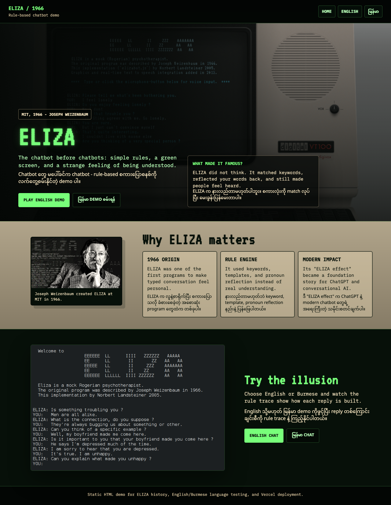
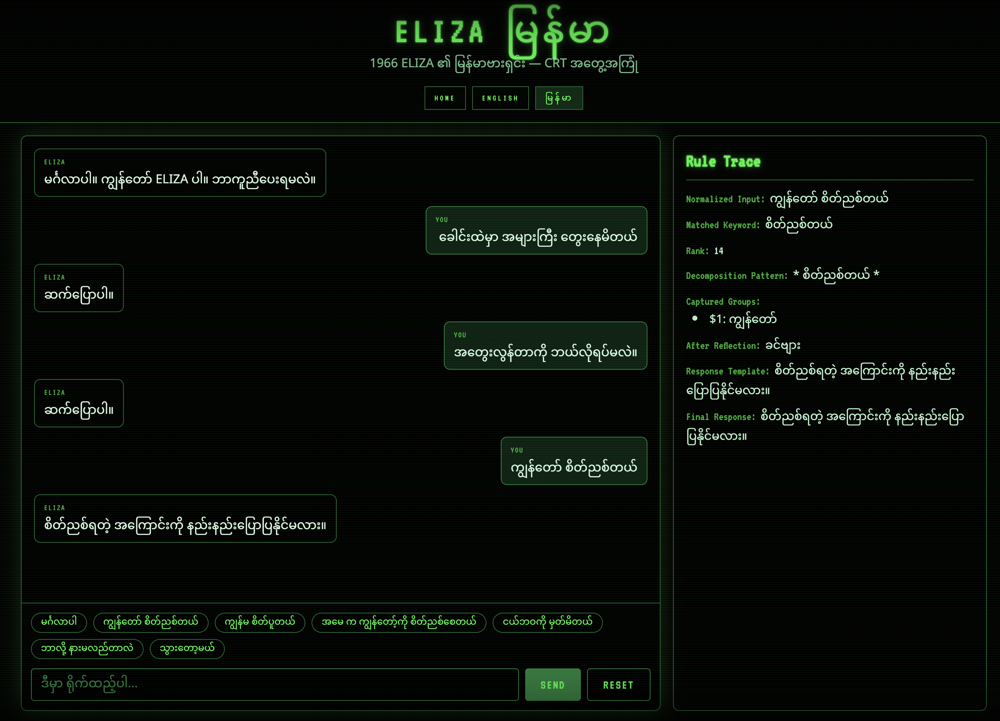

# ELIZA Rule-Based Chatbot Demo



This repository packages a small, static ELIZA showcase with a shared home page and two playable demos:

- [English CRT demo](./Rule-based-AI-explained.html)
- [Burmese CRT demo](./Rule-based-AI-explained_myanmar.html)

ELIZA was created by Joseph Weizenbaum in 1966 and is one of the earliest and most influential conversational programs. It used hand-written rules, keyword matching, and reflective phrasing to simulate a Rogerian therapist. That design made the chatbot feel surprisingly human, even though it had no real understanding of language.

## Why ELIZA Matters

ELIZA is widely regarded as an ancestor of modern conversational AI and is often described as a godfather of the ChatGPT era. It showed a durable lesson that still matters today: users can attribute intelligence, empathy, and intent to a system that is really just organizing prompts and responses well.

This project keeps that history visible in a browser-friendly form:

- `index.html` is a shared landing page for the deployment
- `Rule-based-AI-explained.html` is the English demo
- `Rule-based-AI-explained_myanmar.html` is the Burmese demo

## What Is Included

- Shared home page with a short ELIZA history and launch buttons
- English demo with chips, reset, and a rule trace panel
- Burmese demo with localized prompts and the same rule-driven experience
- Static files only, so the site can be deployed without a build step

### Burmese Demo Preview



## Local Run

You can open the site directly from the filesystem, or serve it locally with any static file server.

### Option 1: Open the files directly

Open `index.html` in a browser, then use the launch buttons to move between demos.

### Option 2: Use Python

```bash
python3 -m http.server 8000
```

Then visit:

```text
http://localhost:8000
```

### Option 3: Use Node

```bash
npx serve .
```

## Deploy to Vercel

This repo is already structured as a static site, so deployment is straightforward.

1. Push the repository to GitHub.
2. Import the repository into Vercel.
3. Keep the root directory as the project root.
4. Do not add a build command unless you later introduce a build tool.
5. Deploy and use `index.html` as the landing page.

If you prefer the Vercel CLI:

```bash
npm i -g vercel
vercel
```

Because the site is static HTML, Vercel can serve it without extra routing configuration.

## Project Structure

```text
.
├── index.html
├── assets/
│   ├── eliza-burmese-demo.png
│   ├── eliza-home-preview.png
│   ├── eliza-terminal-conversation.png
│   ├── eliza-vt100.webp
│   └── joseph-weizenbaum-eliza.png
├── Rule-based-AI-explained.html
├── Rule-based-AI-explained_myanmar.html
├── README.md
├── LICENSE
└── .gitignore
```

## License

MIT License. See [LICENSE](./LICENSE).
